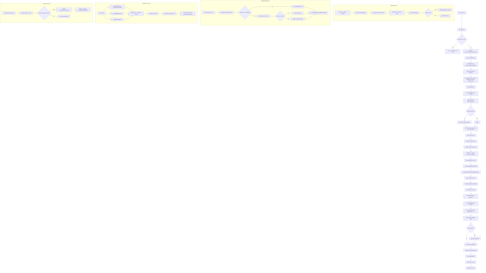

# Flujo IA Archipielago (Mermaid)

```mermaid
flowchart TD
  A[Inicio turno IA] --> B[ejecutarTurno]
  B --> C{Fase actual = play?}
  C -- No --> C1[Log + cierre seguro de turno]
  C -- Si --> D[Inicializar metricas/cooldowns/reintentos]
  D --> E[Lock de exploradores]
  E --> F[Desbloqueo de construcciones pendientes]
  F --> G[Captura oportunista temprana]
  G --> H[Recopilar contexto: hexes, ciudades, recursos, infraestructura]

  H --> I[Flujo Ocupacion]
  I --> I1[Calcular objetivos de corredor]
  I1 --> I2[Ejecutar gusano split/merge relay]
  I2 --> I3{Quedan objetivos?}
  I3 -- Si --> I4[Ocupacion global restante]
  I3 -- No --> I5[Seguir]
  I4 --> I6[Post-corredor: vacate + city push + hill push]
  I5 --> I6

  I6 --> J[Flujo Construccion]
  J --> J1[Construir infraestructura]

  J1 --> K[Analisis tactico/economico]
  K --> K1[Amenazas + frente + recursos vulnerables]

  K1 --> L[Capa estructural y rutas]
  L --> L1[_ejecutarCapaEstructuralRed]
  L1 --> L2[_executeEasyVictoryPointOpportunities]
  L2 --> L3[Evaluar rutas por peso]
  L3 --> L4[Procesar rutas por prioridad]

  L4 --> M[Protocolos post-rutas]
  M --> M1[Prioridad ciudad sin guarnicion]
  M1 --> M2[Protocolo explorador dedicado]
  M2 --> M25[Conquista agresiva de mapa turno >= 5]
  M25 --> M3[Activacion de unidades ociosas]

  M3 --> N{Hubo progreso?}
  N -- No --> N1[Plan de emergencia]
  N -- Si --> O
  N1 --> O[Final sweep obligatorio]

  O --> O1[Intentar acciones restantes]
  O1 --> O2[IA_IDLE_REPORT]
  O2 --> P[Metricas de cierre]
  P --> Q[Finalizar turno IA]

  subgraph SG1 [Subflujo Gusano]
    G1[Seleccionar objetivo corredor] --> G2[Elegir unidad candidata]
    G2 --> G3[Split hacia objetivo parcial]
    G3 --> G4[Merge para conservar masa]
    G4 --> G5[Relay move/attack]
    G5 --> G6{Progreso real?}
    G6 -- No --> G7[Fallback/siguiente objetivo]
    G6 -- Si --> G8[Registrar avance]
  end

  subgraph SG2 [Subflujo Explorador]
    X1[Lock explorador activo] --> X2[Detectar exploradores vivos]
    X2 --> X3{Sobre ruina no saqueada?}
    X3 -- Si --> X4[_requestExploreRuins]
    X3 -- No --> X5[Planear avance a ruina]
    X5 --> X6{Ruina accionable?}
    X6 -- No --> X7[Fallback expansion ligera]
    X6 -- Si --> X8[Mover hacia ruina]
    X4 --> X9[IA_EXPLORER_EXPLORE_ATTEMPT]
    X8 --> X9
    X7 --> X9
  end

  subgraph SG3 [Wrappers de Accion]
    W1[Decision IA] --> W2[_requestMoveUnit / _requestMoveOrAttack]
    W1 --> W3[_requestBuildStructure]
    W1 --> W4[_requestExploreRuins]
    W2 --> W5[Validar locks + cooldown + validez]
    W3 --> W5
    W4 --> W5
    W5 --> W6[Dispatch local/red]
    W6 --> W7[Confirmar aplicacion real]
    W7 --> W8[Log IA_UNIT_EXEC / IA_EXPLORER_EXEC]
  end

  subgraph SG4 [Rutas de Victoria]
    R1[Calcular pesos de rutas] --> R2[Ordenar mayor a menor]
    R2 --> R3{Limite de tiempo/acciones?}
    R3 -- No --> R4[Ejecutar _ejecutarAccionPorRuta]
    R3 -- Si --> R5[Cortar procesamiento]
    R4 --> R6[Registrar resultado action/executed/reason]
  end
```
